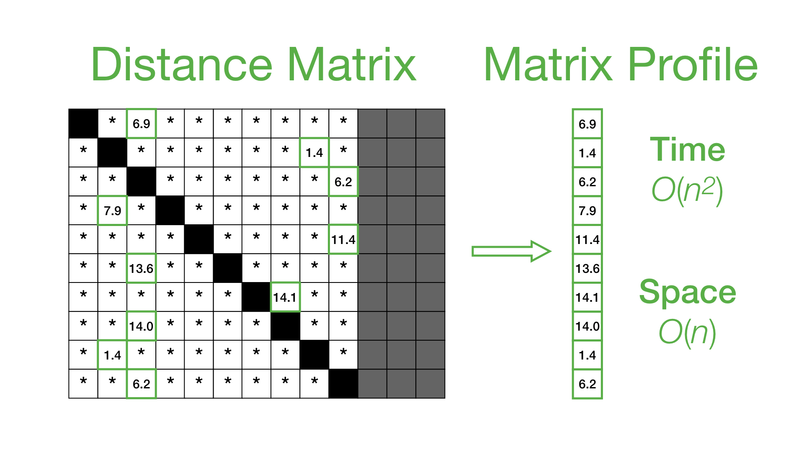

# Summary

STUMPY is a powerful and scalable library that efficiently computes something called the matrix profile [@yeh2016], [@zhu2016], which can be used for a variety of time series data mining tasks such as:

* pattern/motif (approximately repeated subsequences within a longer time series) discovery
* anomaly/novelty (discord) discovery
* shapelet discovery
* semantic segmentation
* density estimation
* time series chains (temporally ordered set of subsequence patterns)
* and more ...

The library also includes support for parallel and distributed computation, multi-dimensional motif discovery [@yeh2017], and time series chains [@zhu2017]. Whether you are an academic, data scientist, software developer, or time series enthusiast, STUMPY is straightforward to install and allows you to compute the matrix profile in the most efficient way. The goal of STUMPY is to allow you to get to your time series insights faster.

# References
  
